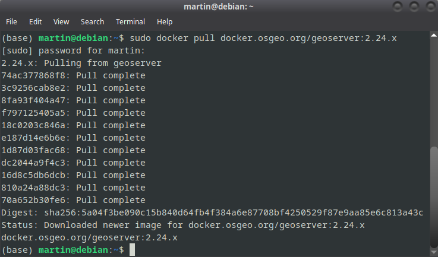

<h2>Instalación en GNU-Linux</h2>


<h3>Vía Docker</h3>


Si usas alguna distribución GNU-Linux te sugerimos que optes por la instalación vía docker; de esta forma no vas a tener problemas de dependencias ni nada de eso. Solo necesitas tener instalado docker, docker compose y permisos de administrador.

La documentación oficial está [aquí](https://docs.geoserver.org/latest/en/user/installation/docker.html)

En una terminal (ctrl+ alt + t) escribir: ```docker pull docker.osgeo.org/geoserver:2.24.x ```




Para correr el contenedor: 

```docker run -it -p8080:8080 docker.osgeo.org/geoserver:2.24.x ```

Si queremos utilizar el contenedor con una carpeta para poner data (shapes, etc) debemos correr

```sudo docker run --mount type=bind,src=/home/martin/Documents/docker,target=/opt/geoserver_data -it -p8080:8080 docker.osgeo.org/geoserver:2.24.x ```

en donde /home/martin/Documents/docker es la carpeta donde irán los shapes


Comandos útiles:
* Estructura básica de comandos ```docker <comando> --help```
* Chequear versión```docker version``` 
* Chequear versión con menú de ayuda```docker version --help```
* Ver que imágenes tenemos ```docker images```
* Crear imagen```docker image build --help```
* Crear imagen con un tag y ubicación ```docker image build -t <tag/nombre que va a tener la imagen> <ubicacion Dockerfile>```

```docker image build -t <usuario>/<imagen> ```

```docker container ps --help ```

Para chequear los contenedores corriendo
```docker container ps ```

Para chequear todos los contenedores (corriendo o no)
```docker container ps -a```

Si el docker ya fue creado
```docker container start --help```

```docker container start <ID del contenedor>```


docker container stop <id del contenedor>
docker container kill <id del contenedor>


Borrar contenedores parados

```docker system prune```

Borrar contenedores

```docker container rmi <id/tag de la imagen>```

La interfaz de geoserver se ejecuta a través de un navegador. Escribir: 


```
http://localhost:8080/geoserver
```


El usuario y contraseña predeterminado son: u: admin p: geoserver


