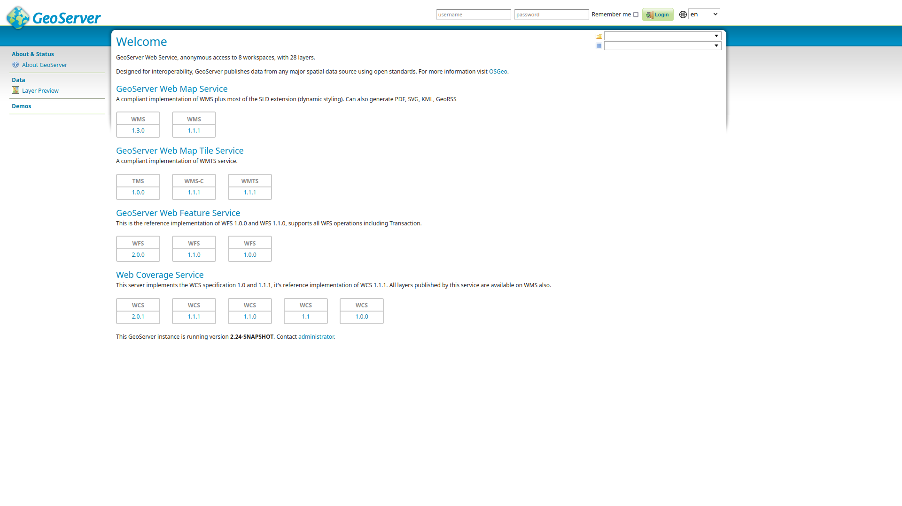
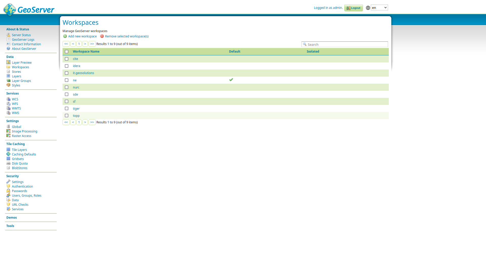
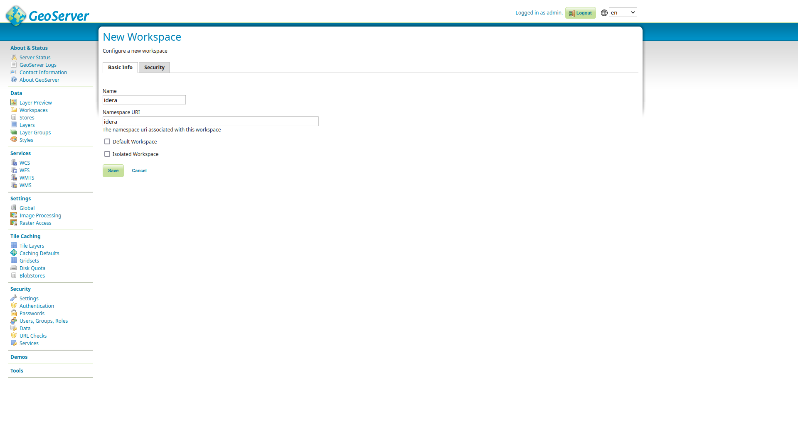
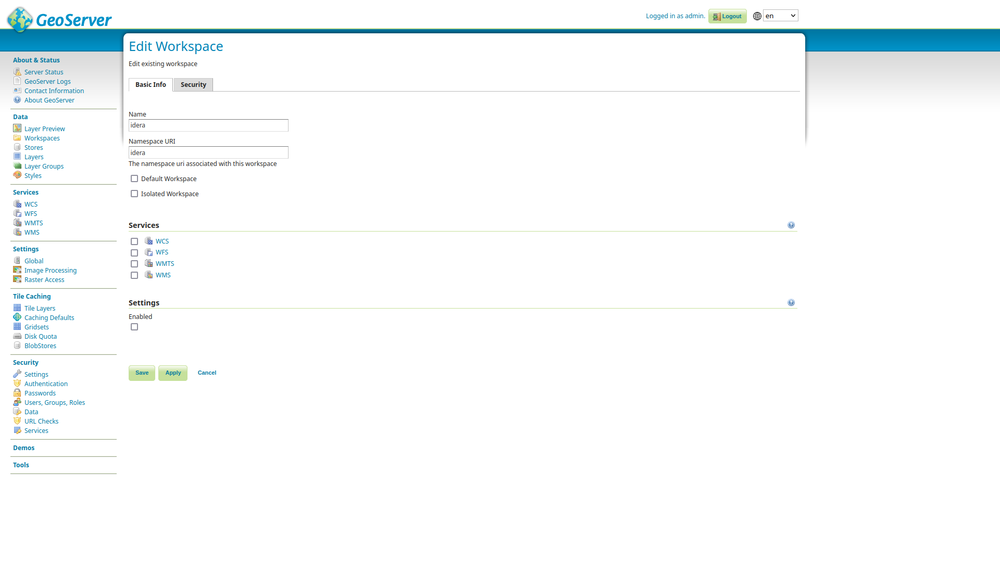
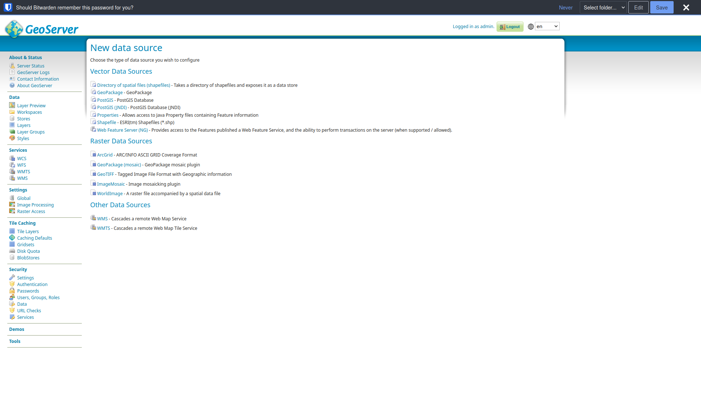
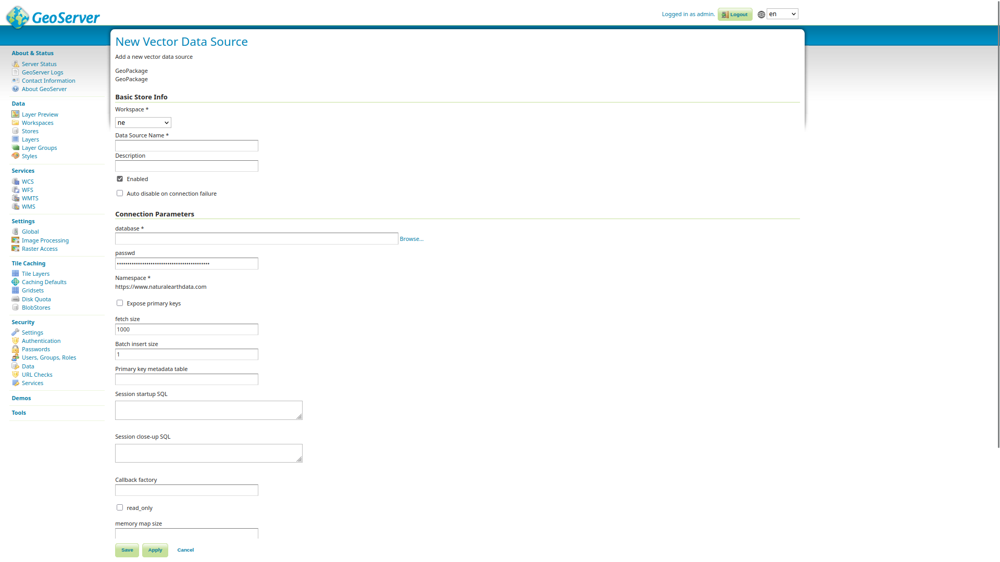
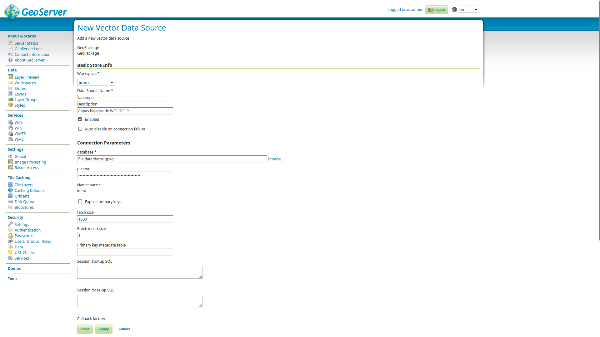
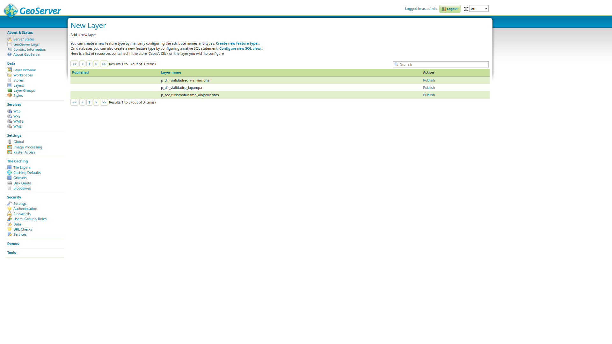
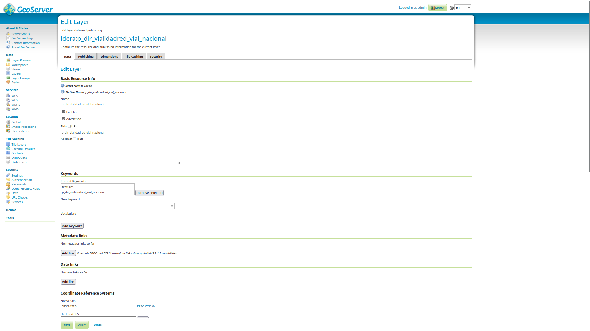

La interfaz de geoserver se ejecuta a través de un navegador. Escribir la URL de acceso local: 


```
http://localhost:8080/geoserver
```


El usuario y contraseña predeterminado son: u: admin p: geoserver


<h3>Espacios de Trabajo</h3>

Los espacios de trabajo son: contenedores lógicos que sirven para realizar distintos agrupamientos de datos con el fin de organizarlos y gestionaros. A cada espacio de trabajo se le pueden designar ajustes y configuraciones específicas afectando todo el conjunto de capas. Además, para cada espacio de trabajo se pueden configurar los usuarios y permisos de acceso para editar las capas.

Para este ejemplo vamos a crear un espacio de trabajo que se va a llamar IDERA, el cual va a “ordenar” las capas que utilizaremos en este taller.

Para crear / consultar los espacios de trabajo podemos ir al menú de la izquierda Workspaces / Espacios de Trabajo. 

Desde aqui podemos, crear, eliminar o ver los espacios que disponemos





	

Creación de Espacios de trabajo





Configuración de Espacios de Trabajo





<h3>Almacen de datos (stores)</h3>
Geoserver lee los datos desde almacenes de datos. Estos pueden ser archivos individuales, base de datos otros geoservicios, etc.




Para cargar capas al geoserver debemos copiar los archivos a la carpeta Data dentro de geoserver. En nuestro ejemplo, copiamos un archivo geopackage que contiene capas de algunos geoservicios de IDERA.

En workspace, vamos a seleccionar IDERA (el espacio de trabajo que creamos anteriormente)





Vamos a seleccionar la fuente de datos 











<h3>Capas y grupo de capas</h3>

<h3>Estilos</h3>


